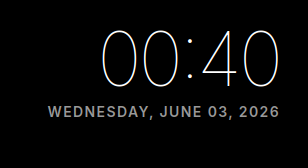

# mirrordash-clock
 
Clock and date widget with 12h/24h formatting, localizations, and sleek layout sizes for MirrorDash.

## Features
- Displays current time and date in customizable formats.
- Supports 12-hour or 24-hour modes.
- Show/hide seconds toggle.
- Clean HUD design.

## Installation
 
Install in editable mode for local development:
```bash
uv pip install -e .
```

## Configuration

This module does not require external API keys. Configure its display parameters via the Admin Dashboard:
* **Format**: `"12h"` or `"24h"` (defaults to global setting).
* **Show Seconds**: Toggle `true` / `false` (default `true`).
* **Date Format**: `"full"`, `"long"`, `"medium"`, `"short"`, or `"yyyy-MM-dd"` (defaults to `"full"`).

## Translations
* Fully localized in **Swedish** (`sv`) and **English** (`en`) for day of the week and month name labels (synced with the user's preferred global language setting).

## Screenshot


